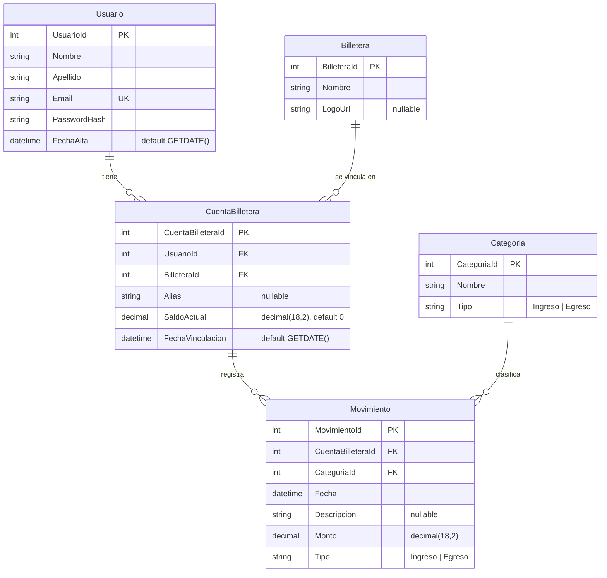

# Unificador de Billeteras Virtuales

> Proyecto académico del equipo para la materia **Programación III**
> Tecnicatura Universitaria en Programación · UTN FRRe · Ciclo 2026

## De qué trata el proyecto

Hoy una persona promedio en Argentina tiene su dinero repartido entre varias billeteras
virtuales: cobra el sueldo en una, paga el transporte con otra, junta puntos en una tercera.
El resultado es que **nadie tiene una foto clara de cuánta plata tiene ni en qué la gasta**:
hay que abrir cinco apps distintas y sumar a mano.

El **Unificador de Billeteras Virtuales** resuelve ese problema. Es un sistema que le permite
a un usuario **consolidar en una única vista** las cuentas y los movimientos que tiene en
distintas billeteras virtuales. El usuario vincula sus cuentas (de Mercado Pago, Ualá, Brubank,
Naranja X, Personal Pay, etc.), registra sus movimientos clasificados por categoría, y obtiene
un panorama unificado de sus saldos y de su actividad financiera.

Cuando el sistema esté terminado al final del cuatrimestre contemplará el alta de usuarios con
autenticación, la vinculación de múltiples cuentas por usuario, el registro de ingresos y egresos
con actualización automática de saldos, reportes y filtros avanzados, y control de acceso por
usuario. Este repositorio cubre los **cimientos**: la configuración del backend con autenticación
y el modelo de datos con sus operaciones CRUD básicas.

## Estado actual del proyecto

  API REST construida con **.NET 10 (ASP.NET Core Web API)**. Incluye autenticación **JWT** con
  `Microsoft.AspNetCore.Authentication.JwtBearer` (validando issuer, audience, lifetime y firma),
  **CORS** abierto (política `AllowAll`), y toda la configuración (connection string + parámetros
  JWT) leída desde `appsettings.json` vía `IConfiguration`. Expone endpoints de **registro, login
  y perfil** (`/api/auth/register`, `/api/auth/login`, `/api/auth/me`) con hash de contraseñas
  **BCrypt**, más los endpoints de prueba **`/api/time`** (público) y **`/api/time/secure`**
  (protegido) que permiten verificar end-to-end que el JWT funciona.

  Las **5 entidades** del dominio (`Usuario`, `Billetera`, `CuentaBilletera`, `Categoria`,
  `Movimiento`) persistidas en **SQL Server**, con **dos enfoques de acceso a datos en paralelo**:
  **ADO.NET puro** (`Microsoft.Data.SqlClient`) y **Entity Framework Core**. Ambos implementan las
  mismas interfaces de repositorio y se intercambian por inyección de dependencias. Encima de los
  repositorios hay una **capa de Negocio** con DTOs, y por arriba **controllers CRUD** para cada
  entidad.

## Equipo

Equipo — alumnos de la TUP, UTN FRRe.
Fabricio Thompson
Franco Barrabino
Lautaro Oporto

## Stack técnico

| Categoría      | Tecnología                                            |
|----------------|--------------------------------------------------------|
| Framework      | .NET 10 (ASP.NET Core Web API)                        |
| Lenguaje       | C# 14 (incluido en .NET 10)                           |
| Base de datos  | SQL Server (Express o Developer)                      |
| Acceso a datos | ADO.NET (`Microsoft.Data.SqlClient`) + EF Core 10     |
| Auth           | JWT (`Microsoft.AspNetCore.Authentication.JwtBearer`) |
| Hash de pwd    | BCrypt.Net-Next                                       |

## Arquitectura

Arquitectura en capas multi-proyecto:

```
┌─────────────────────────────────────────────────┐
│           Billeteras.Apps.WebApiApp             │  ← Capa de Presentación
│            (Controllers, JWT, DI)               │
└────────────────────┬────────────────────────────┘
                     │
┌────────────────────▼────────────────────────────┐
│           Billeteras.Negocio                    │  ← Capa de Negocio
│           (Servicios, DTOs)                     │
└────────────────────┬────────────────────────────┘
                     │
       ┌─────────────┴─────────────┐
       │                           │
┌──────▼─────────────┐  ┌──────────▼──────────────┐
│   Billeteras.Datos │  │    Billeteras.DatosEF   │  ← Capa de Datos
│   (ADO.NET puro)   │  │ (Entity Framework Core) │     (dos implementaciones)
└──────┬─────────────┘  └──────────┬──────────────┘
       │                           │
       └─────────────┬─────────────┘
                     │
            ┌────────▼──────────┐
            │    Billeteras.    │  ← Capa de Entidades
            │    Entidades      │     (POCOs compartidos)
            └───────────────────┘
```

Las **interfaces de repositorio** (`IUsuarioRepository`, `IBilleteraRepository`, etc.) viven en
`Billeteras.Datos/Interfaces`. Tanto la implementación **ADO** (en `Billeteras.Datos`) como
la **EF Core** (en `Billeteras.DatosEF`) las implementan, y se intercambian desde `Program.cs`
vía inyección de dependencias. **Por defecto se usa EF Core**; al lado de cada registro EF queda
comentada la línea equivalente con la implementación ADO:

```csharp
builder.Services.AddScoped<IUsuarioRepository, UsuarioRepositoryEF>();
// builder.Services.AddScoped<IUsuarioRepository>(_ => new UsuarioRepositoryAdo(connStr));
```

## Modelo de datos



## Endpoints expuestos

### Autenticación — `AuthController`

| Método | Ruta                 | Descripción                                  | Auth      |
|--------|----------------------|----------------------------------------------|-----------|
| POST   | `/api/auth/register` | Registra un usuario (email único + BCrypt)   | Público   |
| POST   | `/api/auth/login`    | Valida credenciales y devuelve un JWT        | Público   |
| GET    | `/api/auth/me`       | Devuelve el usuario del token                | 🔒 JWT    |

### Prueba de auth — `TimeController`

| Método | Ruta                | Descripción                          | Auth      |
|--------|---------------------|--------------------------------------|-----------|
| GET    | `/api/time`         | Hora del server (demo público)       | Público   |
| GET    | `/api/time/secure`  | Hora del server + usuario (demo)     | 🔒 JWT    |

### CRUD del dominio (TP-04)

| Método | Ruta                          | Descripción                  | Auth |
|--------|-------------------------------|------------------------------|------|
| GET    | `/api/usuarios`               | Lista usuarios               | —    |
| GET    | `/api/usuarios/{id}`          | Usuario por id               | —    |
| PUT    | `/api/usuarios/{id}`          | Actualiza usuario            | —    |
| DELETE | `/api/usuarios/{id}`          | Elimina usuario (hard)       | —    |
| GET    | `/api/billeteras`             | Lista billeteras             | —    |
| GET    | `/api/billeteras/{id}`        | Billetera por id             | —    |
| POST   | `/api/billeteras`             | Crea billetera               | —    |
| PUT    | `/api/billeteras/{id}`        | Actualiza billetera          | —    |
| DELETE | `/api/billeteras/{id}`        | Elimina billetera (hard)     | —    |
| GET    | `/api/cuentas-billetera`      | Lista cuentas                | —    |
| GET    | `/api/cuentas-billetera/{id}` | Cuenta por id                | —    |
| POST   | `/api/cuentas-billetera`      | Crea cuenta                  | —    |
| PUT    | `/api/cuentas-billetera/{id}` | Actualiza cuenta             | —    |
| DELETE | `/api/cuentas-billetera/{id}` | Elimina cuenta (hard)        | —    |
| GET    | `/api/categorias`             | Lista categorías             | —    |
| GET    | `/api/categorias/{id}`        | Categoría por id             | —    |
| POST   | `/api/categorias`             | Crea categoría               | —    |
| PUT    | `/api/categorias/{id}`        | Actualiza categoría          | —    |
| DELETE | `/api/categorias/{id}`        | Elimina categoría (hard)     | —    |
| GET    | `/api/movimientos`            | Lista movimientos            | —    |
| GET    | `/api/movimientos/{id}`       | Movimiento por id            | —    |
| POST   | `/api/movimientos`            | Crea movimiento              | —    |
| PUT    | `/api/movimientos/{id}`       | Actualiza movimiento         | —    |
| DELETE | `/api/movimientos/{id}`       | Elimina movimiento (hard)    | —    |

## Estructura del repositorio

```
Backend/
├── Billeteras.sln
├── db/
│   └── init.sql                         # Script de creación de DB + seeds
├── Billeteras.Entidades/             # POCOs del dominio (DataAnnotations)
├── Billeteras.Datos/                 # Interfaces de repo + implementación ADO.NET
│   └── Interfaces/
├── Billeteras.DatosEF/               # DbContext + implementación EF Core de las interfaces
├── Billeteras.Negocio/               # Servicios + DTOs (mapeo manual)
│   ├── Interfaces/
│   └── Dtos/
└── Billeteras.Apps.WebApiApp/        # Web API: Program.cs, Controllers, DTOs de API
    ├── Controllers/
    ├── Dtos/
    ├── Requests/                        # Archivos .http de prueba
    └── Properties/
```

## Roadmap (próximos TPs)

| TP    | Descripción                                                    | Estado     |
|-------|----------------------------------------------------------------|------------|
| TP-01 | Definición del dominio y prototipo de interfaz                 | (a definir)|
| TP-02 | Configuración inicial del backend y autenticación              | ✅ Hecho   |
| TP-03 | Integración Frontend–Backend                                   | Pendiente  |
| TP-04 | Modelo de datos y primeras operaciones CRUD                    | ✅ Hecho   |
| TP-05 | Implementación de entidades principales e interfaces           | Pendiente  |
| TP-06 | Operaciones maestro-detalle y transacciones                    | Pendiente  |
| TP-07 | Flujos operativos complejos y control de estados               | Pendiente  |
| TP-08 | Seguridad y control de acceso                                  | Pendiente  |
| TP-09 | Consultas avanzadas, filtros y reportes                        | Pendiente  |
| TP-10 | Documentación técnica de la API y pruebas                      | Pendiente  |