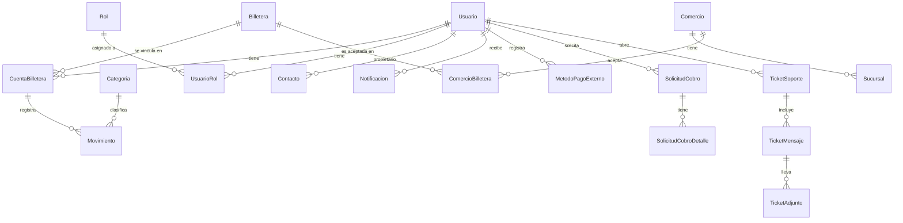

# Unificador de Billeteras Virtuales (SaOT)

> Proyecto académico del equipo para la materia **Programación III**
> Tecnicatura Universitaria en Programación · UTN FRRe · Ciclo 2026

## De qué trata el proyecto

Hoy una persona promedio en Argentina tiene su dinero repartido entre varias billeteras
virtuales: cobra el sueldo en una, paga el transporte con otra, junta puntos en una tercera.
El resultado es que **nadie tiene una foto clara de cuánta plata tiene ni en qué la gasta**:
hay que abrir cinco apps distintas y sumar a mano.

El **Unificador de Billeteras Virtuales** (SaOT) resuelve ese problema. Es un sistema que le
permite a un usuario **consolidar en una única vista** las cuentas y los movimientos que tiene
en distintas billeteras virtuales. El usuario vincula sus cuentas (de Mercado Pago, Ualá,
Brubank, Naranja X, Personal Pay, etc.), registra sus movimientos clasificados por categoría,
opera entre ellas (enviar, cambiar, pagar QR) y obtiene un panorama unificado de sus saldos y
de su actividad financiera.

## Estado actual del proyecto

  API REST construida con **.NET 10 (ASP.NET Core Web API)**. Incluye autenticación **JWT**
  con `Microsoft.AspNetCore.Authentication.JwtBearer` (validando issuer, audience, lifetime y
  firma), **CORS** abierto (política `AllowAll`), y toda la configuración (connection strings
  SQL Server / Neo4j + parámetros JWT) leída desde `appsettings.json` vía `IConfiguration`.
  Expone endpoints de **registro, login y perfil** con hash **BCrypt**, además de **roles**
  (`User` / `Admin`) embebidos en el token y consultados desde la tabla `UsuarioRol`.

  El **modelo de datos relacional** abarca **20+ tablas** (las 5 entidades base más la
  extensión de seguridad, contactos, comercios, solicitudes de cobro, soporte técnico,
  notificaciones y métodos de pago externos). Persistencia en **SQL Server**, con **dos
  enfoques de acceso a datos en paralelo**: **ADO.NET puro** (`Microsoft.Data.SqlClient`) y
  **Entity Framework Core**. Ambos implementan las mismas interfaces de repositorio y se
  intercambian por inyección de dependencias.

  Las **operaciones del flujo principal del usuario** (Enviar, Cambiar entre wallets, Pagar
  QR) se ejecutan bajo control **transaccional** (`IDbContextTransaction` con
  `BeginTransaction` / `Commit` / `Rollback`): cada operación valida saldo y tipo de
  categoría, inserta los movimientos correspondientes y actualiza el saldo de las cuentas
  involucradas dentro de la misma transacción. El sistema también soporta **anulación de
  movimientos con reversión automática de saldo**, manteniendo el registro original
  intacto como traza para auditoría.

  La **base de grafos Neo4j** complementa el modelo relacional para responder consultas que
  en SQL serían costosas (red de transferencias entre usuarios, comercios más frecuentes,
  billeteras en común). Tras cada operación SQL exitosa, un hook de Negocio espeja el evento
  en el grafo (`TRANSFIRIO`, `PAGO_EN`, `ACEPTA`). Los fallos del grafo no rompen la
  operación financiera: SQL es la fuente de verdad.

  El **frontend móvil** es una app **Expo + React Native + TypeScript** con navegación basada
  en **Expo Router**. Implementa los flujos de autenticación, vinculación de billeteras
  (con estado de sincronización), home con balance consolidado, detalle de billetera
  parametrizado por proveedor (Mercado Pago, Ualá, Lemon), y los tres flujos transaccionales
  (Enviar, Pedir, Cambiar, Pagar QR) cableados contra los endpoints del backend.

## Equipo

Equipo — alumnos de la TUP, UTN FRRe.
- Fabricio Thompson
- Franco Barrabino
- Lautaro Oporto

## Stack técnico

| Categoría        | Tecnología                                                |
|------------------|-----------------------------------------------------------|
| Backend          | .NET 10 (ASP.NET Core Web API)                            |
| Lenguaje BE      | C# 14 (incluido en .NET 10)                               |
| Base relacional  | SQL Server (Express 2025 en dev, instancia `SQLEXPRESS`)  |
| Acceso a datos   | ADO.NET (`Microsoft.Data.SqlClient`) + EF Core 10         |
| Base de grafos   | Neo4j 2026 (Neo4j Desktop en dev)                         |
| Driver grafo     | `Neo4j.Driver` (singleton, `IAsyncDisposable`)            |
| Auth             | JWT (`Microsoft.AspNetCore.Authentication.JwtBearer`)     |
| Hash de pwd      | BCrypt.Net-Next                                           |
| Frontend         | Expo SDK 54 + React Native 0.81 + TypeScript              |
| Navegación FE    | Expo Router (file-based)                                  |
| Lockfile FE      | pnpm                                                       |

## Arquitectura

Arquitectura en capas multi-proyecto:

```
┌──────────────────────────────────────────────────────────┐
│                   Frontend (Expo)                         │  ← App móvil iOS/Android/Web
│            (Expo Router · WalletsContext · API client)    │
└───────────────────────────┬───────────────────────────────┘
                            │ HTTP / JSON
┌───────────────────────────▼───────────────────────────────┐
│               Billeteras.Apps.WebApiApp                   │  ← Capa de Presentación
│         (Controllers · JWT · DI · Neo4j bootstrap)        │
└───────────────────────────┬───────────────────────────────┘
                            │
┌───────────────────────────▼───────────────────────────────┐
│                Billeteras.Negocio                         │  ← Capa de Negocio
│        (Servicios, DTOs, hooks Neo4j post-commit)         │
└───────────────────────────┬───────────────────────────────┘
                            │
              ┌─────────────┴─────────────┐
              │                           │
┌─────────────▼──────────┐  ┌─────────────▼──────────────┐
│   Billeteras.Datos     │  │     Billeteras.DatosEF      │  ← Capa de Datos
│   (ADO.NET puro)       │  │  (EF Core + transacciones)  │     (dos implementaciones)
└─────────────┬──────────┘  └─────────────┬──────────────┘
              │                           │
              └─────────────┬─────────────┘
                            │
                  ┌─────────▼──────────┐
                  │    Billeteras.     │  ← Capa de Entidades
                  │    Entidades       │     (POCOs compartidos)
                  └────────────────────┘

                  ┌─────────────────────────┐
                  │      SQL Server         │  ← Fuente de verdad financiera
                  └─────────────────────────┘
                  ┌─────────────────────────┐
                  │       Neo4j             │  ← Espejo de relaciones
                  └─────────────────────────┘
```

Las **interfaces de repositorio** (`IUsuarioRepository`, `IOperacionesRepository`, etc.)
viven en `Billeteras.Datos/Interfaces`. Tanto la implementación **ADO** como la **EF Core**
las implementan, y se intercambian desde `Program.cs` vía inyección de dependencias. **Por
defecto se usa EF Core**.

## Modelo de datos relacional

Las 5 entidades base más la extensión de 14 tablas adicionales que cubren seguridad,
contactos, comercios, solicitudes de cobro, soporte técnico, notificaciones y métodos de
pago externos. Mínimo requerido por la consigna: 20 tablas + 10 relaciones 1–N + 3
relaciones N–N. Cumplido.



El script de inicialización [`backend/db/init.sql`](backend/db/init.sql) es **idempotente**
(usa `IF DB_ID`, `IF OBJECT_ID`, `IF COL_LENGTH`, `IF NOT EXISTS sys.check_constraints`) y
se puede correr varias veces sin romper la base. Incluye seeds de catálogo (billeteras
argentinas, categorías de movimiento, roles `User` / `Admin`) y los `ALTER TABLE` necesarios
para el campo JSON de metadata y el flag de anulación.

## Endpoints expuestos

### Autenticación — `AuthController`

| Método | Ruta                 | Descripción                                  | Auth     |
|--------|----------------------|----------------------------------------------|----------|
| POST   | `/api/auth/register` | Registra un usuario (email único + BCrypt)   | Público  |
| POST   | `/api/auth/login`    | Valida credenciales y devuelve un JWT con roles | Público  |
| GET    | `/api/auth/me`       | Devuelve el usuario del token                | 🔒 JWT   |

### Operaciones transaccionales — `OperacionesController`

| Método | Ruta                                   | Descripción                                                          | Auth   |
|--------|----------------------------------------|----------------------------------------------------------------------|--------|
| POST   | `/api/operaciones/enviar`              | Egreso desde una cuenta (1 movimiento + saldo)                       | 🔒 JWT |
| POST   | `/api/operaciones/cambiar`             | Cambio entre 2 wallets del mismo usuario (2 movimientos + 2 saldos)  | 🔒 JWT |
| POST   | `/api/operaciones/pagar-qr`            | Pago a comercio (egreso + saldo + metadata JSON del QR)              | 🔒 JWT |
| POST   | `/api/operaciones/{movimientoId}/anular` | Anula un movimiento y revierte el saldo                            | 🔒 JWT |

Todas validan **ownership**: la cuenta involucrada tiene que pertenecer al usuario
autenticado. Los usuarios con rol `Admin` saltean este chequeo (uso de soporte).

### CRUD del dominio

| Método | Ruta                          | Auth requerida                  |
|--------|-------------------------------|---------------------------------|
| varios | `/api/usuarios/*`             | 🔒 JWT (lista: solo Admin)      |
| varios | `/api/cuentas-billetera/*`    | 🔒 JWT (lista: solo Admin)      |
| varios | `/api/movimientos/*`          | 🔒 JWT (lista: solo Admin)      |
| varios | `/api/contactos/*`            | 🔒 JWT                          |
| varios | `/api/tickets-soporte/*`      | 🔒 JWT                          |
| varios | `/api/metodos-pago/*`         | 🔒 JWT                          |
| varios | `/api/billeteras/*`           | Público (catálogo)              |
| varios | `/api/categorias/*`           | Público (catálogo)              |

### Endpoints "me" — filtran por usuario autenticado

| Método | Ruta                            | Descripción                          | Auth   |
|--------|---------------------------------|--------------------------------------|--------|
| GET    | `/api/cuentas-billetera/me`     | Cuentas vinculadas al usuario actual | 🔒 JWT |
| GET    | `/api/movimientos/me`           | Movimientos del usuario actual       | 🔒 JWT |

### Prueba de auth — `TimeController`

| Método | Ruta                | Descripción                          | Auth     |
|--------|---------------------|--------------------------------------|----------|
| GET    | `/api/time`         | Hora del server (demo público)       | Público  |
| GET    | `/api/time/secure`  | Hora del server + usuario (demo)     | 🔒 JWT   |

## Frontend (Expo)

Aplicación móvil con navegación basada en **Expo Router** (file-based). Estructura de
rutas agrupadas por flujo:

```
Frontend/app/
├── _layout.tsx
├── index.tsx
├── (auth)/        # login + registro
├── (tabs)/        # home, billeteras, actividad, perfil
├── (details)/     # detalle de billetera (parametrizado mp/ua/lm),
│                  #   vincular nueva billetera, sincronizando…, conectada
├── (send)/        # flujo Enviar (recipient → amount → confirm → success)
├── (request)/     # flujo Pedir
├── (exchange)/    # flujo Cambiar (amount → confirm → success)
└── (payqr)/       # flujo Pagar QR (scanner → detected → success)
```

El estado global de billeteras y movimientos vive en
[`src/context/WalletsContext.tsx`](Frontend/src/context/WalletsContext.tsx), que orquesta la
carga paralela de cuentas + actividad y expone `refresh()` para revalidar después de cada
operación. La conexión a la API se centraliza en
[`src/api/client.ts`](Frontend/src/api/client.ts) con `ApiError` tipado, manejo de errores
de red y JWT en memoria. Los servicios de dominio (`cuentas.ts`, `movimientos.ts`,
`operaciones.ts`) consumen ese cliente y exponen funciones tipadas a las pantallas.

Para correr el FE contra el backend desde un celular físico hay que ajustar `BASE_URL` en
`client.ts` apuntando a la IP LAN de la PC (`http://192.168.x.x:5001`) y abrir el firewall.

## Neo4j (BD-04)

La integración con la base de grafos vive en `Billeteras.Negocio`:

- [`INeo4jService`](backend/Billeteras.Negocio/Interfaces/INeo4jService.cs) abstrae el driver
  con dos métodos: `ExecuteAsync` (escritura / esquema) y `QueryAsync` (lectura).
- [`Neo4jService`](backend/Billeteras.Negocio/Neo4jService.cs) implementa la interfaz como
  singleton `IAsyncDisposable` y lee `Uri / User / Password` desde la sección `Neo4j` del
  `appsettings.json`.

Al arrancar la API (`Program.cs`) se crean los 4 constraints de unicidad sobre
`Usuario`, `Billetera`, `CuentaBilletera` y `Comercio`, todo dentro de un `try/catch`
defensivo: si Neo4j no está corriendo la API sigue funcionando contra SQL.

Los scripts de demo viven en [`backend/db/neo4j/`](backend/db/neo4j/):

| Archivo | Para qué sirve |
|---|---|
| [`seed_demo.cypher`](backend/db/neo4j/seed_demo.cypher)       | Espeja en Neo4j los nodos y relaciones que producirían los hooks de Negocio. Usa IDs reales del seed SQL. |
| [`queries_demo.cypher`](backend/db/neo4j/queries_demo.cypher) | Las 4 consultas de negocio de la sección 3.9 del informe BD-04 listas para pegar en el Browser. |
| [`README.md`](backend/db/neo4j/README.md)                     | Convención de nombres de relaciones (sin tilde), estado de hooks por evento y cómo correr los scripts. |

## Estructura del repositorio

```
SAOT-Unificador-de-Billeteras-1/
├── Billeteras.sln
├── README.md                                  # Este archivo
├── backend/
│   ├── db/
│   │   ├── init.sql                           # Script idempotente de creación SQL Server
│   │   ├── seed_test.sql                      # Datos de prueba opcionales
│   │   └── neo4j/                             # Scripts Cypher (BD-04)
│   │       ├── seed_demo.cypher
│   │       ├── queries_demo.cypher
│   │       └── README.md
│   ├── Billeteras.Entidades/                  # POCOs del dominio (DataAnnotations)
│   ├── Billeteras.Datos/                      # Interfaces de repo + implementación ADO.NET
│   │   └── Interfaces/
│   ├── Billeteras.DatosEF/                    # DbContext + implementación EF Core
│   ├── Billeteras.Negocio/                    # Servicios + DTOs + Neo4jService
│   │   ├── Interfaces/
│   │   └── Dtos/
│   └── Billeteras.Apps.WebApiApp/             # Web API: Program.cs, Controllers, DTOs
│       ├── Controllers/
│       ├── Dtos/
│       ├── Requests/                          # Archivos .http de prueba
│       └── Properties/
└── Frontend/
    ├── app/                                   # Expo Router (file-based routing)
    │   ├── (auth)/                            # login / registro
    │   ├── (tabs)/                            # home / billeteras / actividad / perfil
    │   ├── (details)/                         # detalle, vincular, sincronizando
    │   ├── (send)/                            # flujo Enviar
    │   ├── (request)/                         # flujo Pedir
    │   ├── (exchange)/                        # flujo Cambiar
    │   └── (payqr)/                           # flujo Pagar QR
    ├── src/
    │   ├── api/                               # client.ts, auth, cuentas, movimientos, operaciones
    │   ├── components/                        # piezas reusables (botones, glyphs, headers)
    │   ├── context/                           # SessionContext, WalletsContext
    │   ├── data/                              # mocks + tipos (Wallet, ActivityItem)
    │   ├── theme/                             # tokens de diseño
    │   └── utils/                             # format, helpers
    ├── assets/
    ├── app.json
    └── package.json
```

## Cómo correrlo en local

### Requisitos

- .NET SDK 10
- SQL Server (Express 2025 / Developer, instancia `SQLEXPRESS`)
- Neo4j Desktop (instancia `Saot` en `bolt://localhost:7687`)
- Node.js + pnpm (para el frontend)
- Expo Go en el celular (opcional, para probar desde dispositivo)

### Pasos

1. **SQL Server**: abrir `backend/db/init.sql` en SSMS conectado a `localhost\SQLEXPRESS` y
   ejecutarlo (`F5`). El script crea la BD `BilleterasDB`, las 20+ tablas y carga seeds.
2. **Connection strings**: ajustar `backend/Billeteras.Apps.WebApiApp/appsettings.Development.json`
   (SQL Server) y `appsettings.json` (Neo4j password).
3. **Backend**:
   ```powershell
   cd backend\Billeteras.Apps.WebApiApp
   dotnet run --launch-profile http
   ```
   Levanta en `http://localhost:5001` (o `http://0.0.0.0:5001` si lo configurás para LAN).
4. **Frontend**:
   ```powershell
   cd Frontend
   pnpm install
   pnpm start
   ```
   Genera el QR para Expo Go. Si vas a probar desde el celu, cambiá `BASE_URL` en
   `Frontend/src/api/client.ts` a la IP LAN de la PC.
5. **Neo4j (opcional)**: con la instancia corriendo, los 4 constraints se aplican solos al
   arrancar la API. Para poblar el grafo con datos de demo, abrir el Browser y ejecutar
   `backend/db/neo4j/seed_demo.cypher`.

## Roadmap (trabajos prácticos del cuatrimestre)

| TP    | Descripción                                                    | Estado     |
|-------|----------------------------------------------------------------|------------|
| TP-01 | Definición del dominio y prototipo de interfaz                 | ✅ Hecho    |
| TP-02 | Configuración inicial del backend y autenticación              | ✅ Hecho    |
| TP-03 | Integración Frontend–Backend                                   | ✅ Hecho    |
| TP-04 | Modelo de datos y primeras operaciones CRUD                    | ✅ Hecho    |
| TP-05 | Implementación de entidades principales e interfaces           | ✅ Hecho    |
| TP-06 | Operaciones maestro-detalle y transacciones                    | ✅ Hecho    |
| TP-07 | Flujos operativos complejos y control de estados               | ✅ Hecho    |
| TP-08 | Seguridad y control de acceso                                  | ✅ Hecho    |
| TP-09 | Consultas avanzadas, filtros y reportes (incluye Neo4j BD-04)  | 🔄 En curso |
| TP-10 | Documentación técnica de la API y pruebas                      | Pendiente  |
| TP-11 | Mejora de UX y optimización                                    | Pendiente  |
| TP-12 | Presentación preliminar (pre-entrega)                          | Pendiente  |
