# Modelo de datos — SaOT (Unificador de Billeteras Virtuales)

> Base **SQL Server** · 20 tablas de dominio · script de creación: [`init.sql`](init.sql)
> Este documento presenta el **MER** (Modelo Entidad‑Relación, conceptual) y el
> **MR** (Modelo Relacional, lógico). Los diagramas Mermaid se renderizan gráficos en GitHub.

---

## 1) MER — Modelo Entidad‑Relación

Diagrama entidad‑relación con todas las tablas, sus atributos y las cardinalidades.
`PK` = clave primaria · `FK` = clave foránea · `UK` = clave única.

```mermaid
erDiagram
    Usuario ||--o{ CuentaBilletera        : "vincula"
    Billetera ||--o{ CuentaBilletera      : "se usa en"
    CuentaBilletera ||--o{ Movimiento     : "registra"
    Categoria ||--o{ Movimiento           : "clasifica"

    Usuario ||--o{ UsuarioRol             : "tiene"
    Rol ||--o{ UsuarioRol                 : "asignado a"

    Usuario ||--o{ Contacto               : "propietario"
    Usuario ||--o{ Contacto               : "es contacto"

    Comercio ||--o{ Sucursal              : "tiene"
    Comercio ||--o{ ComercioBilletera     : "acepta"
    Billetera ||--o{ ComercioBilletera    : "aceptada por"

    Usuario ||--o{ SolicitudCobro         : "solicita"
    SolicitudCobro ||--o{ SolicitudCobroDetalle : "se divide en"
    Usuario ||--o{ SolicitudCobroDetalle  : "es deudor en"

    MotivoReporte ||--o{ TicketSoporte     : "motiva"
    Usuario ||--o{ TicketSoporte           : "abre"
    TicketSoporte ||--o{ TicketMensaje     : "contiene"
    TicketMensaje ||--o{ TicketAdjunto     : "adjunta"

    Usuario ||--o{ Notificacion            : "recibe"
    Usuario ||--o{ MetodoPagoExterno       : "registra"

    Usuario {
        int      UsuarioId PK
        nvarchar Nombre
        nvarchar Apellido
        nvarchar Email UK
        nvarchar PasswordHash
        datetime FechaAlta
    }
    Billetera {
        int      BilleteraId PK
        nvarchar Nombre
        nvarchar LogoUrl
    }
    Categoria {
        int      CategoriaId PK
        nvarchar Nombre
        nvarchar Tipo "Ingreso|Egreso"
    }
    CuentaBilletera {
        int      CuentaBilleteraId PK
        int      UsuarioId FK
        int      BilleteraId FK
        nvarchar Alias
        decimal  SaldoActual
        datetime FechaVinculacion
        nvarchar Estado "Activa|Inactiva"
    }
    Movimiento {
        int      MovimientoId PK
        int      CuentaBilleteraId FK
        int      CategoriaId FK
        datetime Fecha
        nvarchar Descripcion
        decimal  Monto
        nvarchar Tipo "Ingreso|Egreso"
        nvarchar MetadataExtranjera "JSON (CHECK ISJSON)"
        bit      Anulado
        datetime FechaAnulacion
    }
    Rol {
        int      RolId PK
        varchar  Nombre UK
        varchar  Descripcion
    }
    UsuarioRol {
        int UsuarioId PK
        int RolId PK
    }
    Contacto {
        int      UsuarioPropietarioId PK
        int      UsuarioContactoId PK
        varchar  AliasPersonalizado
        datetime FechaAgregado
    }
    Comercio {
        int     ComercioId PK
        varchar RazonSocial
        varchar Cuit UK
    }
    Sucursal {
        int     SucursalId PK
        int     ComercioId FK
        varchar Direccion
        varchar CodigoQRBase UK
    }
    ComercioBilletera {
        int     ComercioId PK
        int     BilleteraId PK
        decimal TasaComision
    }
    SolicitudCobro {
        int      SolicitudId PK
        int      UsuarioSolicitanteId FK
        decimal  MontoTotal
        datetime FechaVencimiento
        varchar  Estado
    }
    SolicitudCobroDetalle {
        int     DetalleSolicitudId PK
        int     SolicitudId FK
        int     UsuarioDeudorId FK
        decimal MontoMita
        bit     Pagado
    }
    MotivoReporte {
        int     MotivoId PK
        varchar Titulo
        int     Gravedad
    }
    TicketSoporte {
        int      TicketId PK
        int      UsuarioId FK
        int      MotivoId FK
        datetime FechaCreacion
        varchar  Estado
    }
    TicketMensaje {
        int      MensajeId PK
        int      TicketId FK
        bit      RemitenteEsSoporte
        text     CuerpoMensaje
        datetime FechaEnvio
    }
    TicketAdjunto {
        int     AdjuntoId PK
        int     MensajeId FK
        varchar UrlArchivo
        varchar TipoMime
    }
    Notificacion {
        int      NotificacionId PK
        int      UsuarioId FK
        varchar  Titulo
        varchar  Mensaje
        bit      Leida
        datetime FechaEmision
    }
    MetodoPagoExterno {
        int     MetodoId PK
        int     UsuarioId FK
        varchar Tipo
        char    UltimosCuatro
        varchar EntidadEmisora
    }
```

> La tabla **`Auditoria`** no aparece en el MER porque no tiene relaciones por clave foránea:
> la llenan **triggers** (`AFTER INSERT/UPDATE/DELETE`) sobre `Movimiento` y `CuentaBilletera`,
> guardando el registro afectado como JSON. Es una tabla de trazabilidad transversal.

---

## 2) MR — Modelo Relacional

Notación: **PK** en negrita y subrayada, _FK_ en cursiva con su referencia. Toda FK apunta a la
PK de la tabla referenciada.

### Dominio base

- **Usuario**(<u>**UsuarioId**</u>, Nombre, Apellido, Email `UNIQUE`, PasswordHash, FechaAlta)
- **Billetera**(<u>**BilleteraId**</u>, Nombre, LogoUrl)
- **Categoria**(<u>**CategoriaId**</u>, Nombre, Tipo)
- **CuentaBilletera**(<u>**CuentaBilleteraId**</u>, _UsuarioId_ → Usuario, _BilleteraId_ → Billetera, Alias, SaldoActual, FechaVinculacion, Estado)
- **Movimiento**(<u>**MovimientoId**</u>, _CuentaBilleteraId_ → CuentaBilletera, _CategoriaId_ → Categoria, Fecha, Descripcion, Monto, Tipo, MetadataExtranjera `CHECK ISJSON`, Anulado, FechaAnulacion)

### Seguridad y roles

- **Rol**(<u>**RolId**</u>, Nombre `UNIQUE`, Descripcion)
- **UsuarioRol**(<u>**_UsuarioId_** → Usuario, **_RolId_** → Rol</u>)  ·  *N‑N Usuario↔Rol*

### Red de contactos

- **Contacto**(<u>**_UsuarioPropietarioId_** → Usuario, **_UsuarioContactoId_** → Usuario</u>, AliasPersonalizado, FechaAgregado)  ·  *N‑N Usuario↔Usuario (auto‑referencia)*

### Comercios y QR

- **Comercio**(<u>**ComercioId**</u>, RazonSocial, Cuit `UNIQUE`)
- **Sucursal**(<u>**SucursalId**</u>, _ComercioId_ → Comercio, Direccion, CodigoQRBase `UNIQUE`)
- **ComercioBilletera**(<u>**_ComercioId_** → Comercio, **_BilleteraId_** → Billetera</u>, TasaComision)  ·  *N‑N Comercio↔Billetera*

### Solicitudes de cobro

- **SolicitudCobro**(<u>**SolicitudId**</u>, _UsuarioSolicitanteId_ → Usuario, MontoTotal, FechaVencimiento, Estado)
- **SolicitudCobroDetalle**(<u>**DetalleSolicitudId**</u>, _SolicitudId_ → SolicitudCobro, _UsuarioDeudorId_ → Usuario, MontoMita, Pagado)

### Soporte técnico

- **MotivoReporte**(<u>**MotivoId**</u>, Titulo, Gravedad)
- **TicketSoporte**(<u>**TicketId**</u>, _UsuarioId_ → Usuario, _MotivoId_ → MotivoReporte, FechaCreacion, Estado)
- **TicketMensaje**(<u>**MensajeId**</u>, _TicketId_ → TicketSoporte, RemitenteEsSoporte, CuerpoMensaje, FechaEnvio)
- **TicketAdjunto**(<u>**AdjuntoId**</u>, _MensajeId_ → TicketMensaje, UrlArchivo, TipoMime)

### Notificaciones y métodos de pago

- **Notificacion**(<u>**NotificacionId**</u>, _UsuarioId_ → Usuario, Titulo, Mensaje, Leida, FechaEmision)
- **MetodoPagoExterno**(<u>**MetodoId**</u>, _UsuarioId_ → Usuario, Tipo, UltimosCuatro, EntidadEmisora)

### Auditoría

- **Auditoria**(<u>**AuditoriaId**</u>, TablaAfectada, Accion, UsuarioBaseDatos, Fecha, Detalle `JSON`)  ·  *la llenan triggers, sin FK*

---

## 3) Relaciones (cumplimiento de requisitos)

### Relaciones 1‑N (mínimo pedido: 10 — implementadas: 14)

| # | Lado 1 | Lado N | Vía |
|---|--------|--------|-----|
| 1 | Usuario | CuentaBilletera | `CuentaBilletera.UsuarioId` |
| 2 | Billetera | CuentaBilletera | `CuentaBilletera.BilleteraId` |
| 3 | CuentaBilletera | Movimiento | `Movimiento.CuentaBilleteraId` |
| 4 | Categoria | Movimiento | `Movimiento.CategoriaId` |
| 5 | Comercio | Sucursal | `Sucursal.ComercioId` |
| 6 | Usuario | SolicitudCobro | `SolicitudCobro.UsuarioSolicitanteId` |
| 7 | SolicitudCobro | SolicitudCobroDetalle | `SolicitudCobroDetalle.SolicitudId` |
| 8 | Usuario | SolicitudCobroDetalle | `SolicitudCobroDetalle.UsuarioDeudorId` |
| 9 | Usuario | TicketSoporte | `TicketSoporte.UsuarioId` |
| 10 | MotivoReporte | TicketSoporte | `TicketSoporte.MotivoId` |
| 11 | TicketSoporte | TicketMensaje | `TicketMensaje.TicketId` |
| 12 | TicketMensaje | TicketAdjunto | `TicketAdjunto.MensajeId` |
| 13 | Usuario | Notificacion | `Notificacion.UsuarioId` |
| 14 | Usuario | MetodoPagoExterno | `MetodoPagoExterno.UsuarioId` |

### Relaciones N‑N (mínimo pedido: 3 — implementadas: 3)

| # | Entidades | Tabla intermedia |
|---|-----------|------------------|
| 1 | Usuario ↔ Rol | `UsuarioRol` |
| 2 | Usuario ↔ Usuario (contactos) | `Contacto` |
| 3 | Comercio ↔ Billetera | `ComercioBilletera` |

---

## 4) Operaciones maestro‑detalle y transaccionales

| Operación | Maestro → Detalle | Transacción |
|-----------|-------------------|-------------|
| Registrar solicitud de cobro | `SolicitudCobro` → `SolicitudCobroDetalle` (una línea por deudor) | ✅ atómica |
| Abrir ticket de soporte | `TicketSoporte` → `TicketMensaje` → `TicketAdjunto` | ✅ atómica |
| Enviar / Cambiar / Pagar QR | `Movimiento` + actualización de `CuentaBilletera.SaldoActual` | ✅ `BeginTransaction`/`Commit`/`Rollback` |
| Anular movimiento | flag `Anulado` + reversión de saldo | ✅ atómica |
| Vincular billetera | alta de `CuentaBilletera` (estado `Activa`) | ✅ atómica |

## 5) Mecanismos especiales

- **Campo JSON con validación**: `Movimiento.MetadataExtranjera` (`NVARCHAR(MAX)`) con
  `CHECK (ISJSON(...) = 1)`. Guarda metadata de pagos QR (p. ej. el código escaneado).
- **Auditoría automática**: triggers `trg_Auditar_Movimientos` y `trg_Auditar_CuentasBilletera`
  (`AFTER INSERT/UPDATE/DELETE`) insertan en `Auditoria` la acción y el registro afectado como
  JSON (`FOR JSON AUTO`).
- **Soft‑delete**: `CuentaBilletera.Estado` permite desvincular sin borrar (trazabilidad).
- **Script idempotente**: `init.sql` usa `IF OBJECT_ID … IS NULL`, `IF COL_LENGTH … IS NULL` y
  `IF NOT EXISTS …` para poder reejecutarse sin error.
